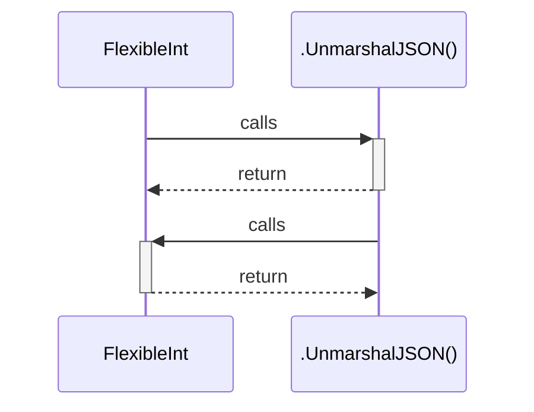

# FlexibleInt

> God node · 2 connections · [D:\dev\letcoode\src\models\earth_table.go](file:///D:/dev/letcoode/src/models/earth_table.go#L55)

## Call Trace Diagram

## Connections by Relation

### calls
- [[.UnmarshalJSON()]] `EXTRACTED`

### contains
- [[earth_table.go]] `EXTRACTED`

---

*Part of the graphify knowledge wiki. See [[index]] to navigate.*