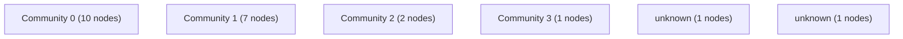

# Knowledge Graph Index

> Auto-generated by graphify. Start here — read community articles for context, then drill into god nodes for detail.

**22 nodes · 16 edges · 6 communities**

---

## System Architecture Flowchart

## Communities
(sorted by size, largest first)

- [[Community 0]] — 10 nodes
- [[Community 1]] — 7 nodes
- [[Community 2]] — 2 nodes
- [[Community 3]] — 1 nodes
- [[unknown]] — 1 nodes
- [[unknown]] — 1 nodes

## God Nodes
(most connected concepts — the load-bearing abstractions)

- [[FlexibleInt]] — 2 connections
- [[HoroscopePage]] — 1 connections
- [[Place]] — 1 connections
- [[Star]] — 1 connections
- [[YearStar]] — 1 connections
- [[InputData]] — 1 connections
- [[form]] — 1 connections
- [[formData]] — 1 connections
- [[data]] — 1 connections
- [[day]] — 1 connections

---

*Generated by [graphify](https://github.com/safishamsi/graphify)*