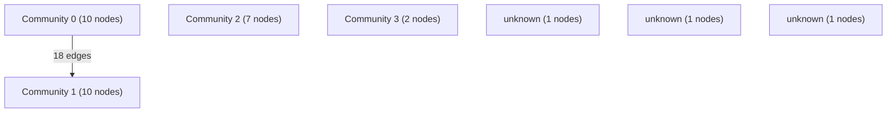

# Knowledge Graph Index

> Auto-generated by graphify. Start here — read community articles for context, then drill into god nodes for detail.

**32 nodes · 43 edges · 7 communities**

---

## System Architecture Flowchart

## Communities
(sorted by size, largest first)

- [[Community 0]] — 10 nodes
- [[Community 1]] — 10 nodes
- [[Community 2]] — 7 nodes
- [[Community 3]] — 2 nodes
- [[unknown]] — 1 nodes
- [[unknown]] — 1 nodes
- [[unknown]] — 1 nodes

## God Nodes
(most connected concepts — the load-bearing abstractions)

- [[form]] — 2 connections
- [[toggleBtn]] — 2 connections
- [[input]] — 2 connections
- [[current]] — 2 connections
- [[next]] — 2 connections
- [[genderBtns]] — 2 connections
- [[genderInput]] — 2 connections
- [[val]] — 2 connections
- [[formData]] — 2 connections
- [[data]] — 2 connections

---

*Generated by [graphify](https://github.com/safishamsi/graphify)*